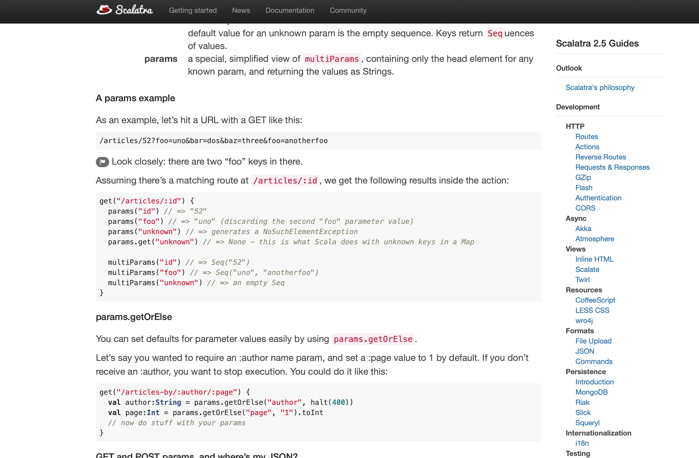
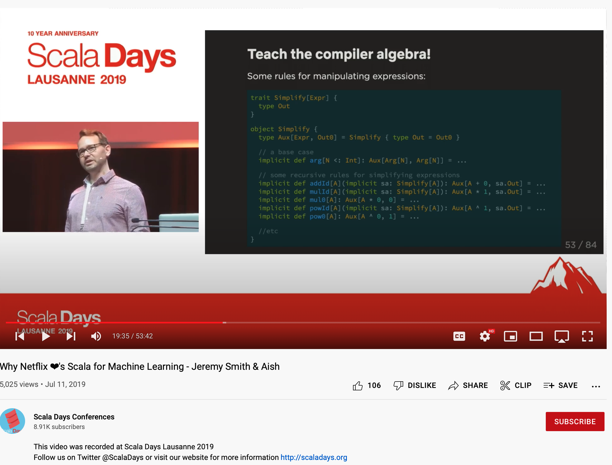
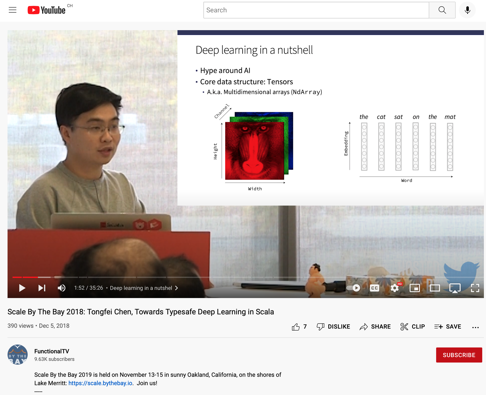

# Introduction

## Rockets explode

<div class="float">


<small>[Explosion of the first Ariane 5 flight, June 4, 1996<br/>© ESA (European Space Agency)](https://www.esa.int/ESA_Multimedia/Images/2009/09/Explosion_of_first_Ariane_5_flight_June_4_1996)</small>

</div>

<div style="height: 395px; display: flex; align-items: center; justify-content: center;">

$$
\gdef\tm#1{\textcolor{953800}{\texttt{{#1}}}}
\gdef\tp#1{\textcolor{8250df}{\texttt{{#1}}}}
\tm{x}
$$

</div>

<aside class="notes">

**Title Slide**

Hello, my name is Matt Bovel and I am a PhD student at EPFL. I am working at LAMP, the lab that builds Scala. It's just next to the Scala center. And I am co-supervised by Martin Odersky.

My research interests are center around what we can qualify as precise types and so today, I will talk about precise types. More specifically, I will mainly talk about singleton types, refinement types, match types and type-level operations. I will give a pretty general presentation. It's not very much research-oriented. Instead, after a very brief introduction the presentation will be completely examples-based. I will show practical examples of what we can achieve with the type system of Scala today, and also what we might be able to achieve in the future. So even if you already know everything about these precise types, you might be interested in this later part.

**TOC**

Ok, before diving into the subject, lets me zoom out for a few slides.

**This slide**

Writing software is hard. It takes time. And even so, all programs that we use everyday are full of bugs. Software bugs cost the U.S. economy an estimated \$59.5 billion annually, or about 0.6 percent of the gross domestic product. So we lose time, money, and in extreme situation, this can lead to catastrophes like the crash of the Ariane 5 rocket—from which you have a picture here.

How can we help? And _what_ can help?

</aside>

## Types can help

<div class="float">


<small>[Artist's view of the configuration of Ariane 6 using four boosters (A64)<br/>© ESA (European Space Agency)](https://www.esa.int/ESA_Multimedia/Images/2018/06/Artist_s_view_of_the_configuration_of_Ariane_6_using_four_boosters_A643)</small>

</div>

<div style="height: 395px; display: flex; align-items: center; justify-content: center;">

$$\tm{x}:\tp{Long}$$

</div>

<aside class="notes">

Well, one of the things that can help are _type systems_. The idea of a type system is to assign a type to each element of a program to make sure that these elements are combined appropriately. If I want to sum two elements and I write $x + y$ for example, I want to make sure that $x$ and $y$ are numbers. If these are something else, then the operation written `+` might have a complete different meaning or not make sense at all.

Types like strings, integer or boolean are not enough. [...]

</aside>

## Literal types

Type inhabited by a single constant value known at compile-time:

```scala
val x: 3 = 3
val y: false = false
val z: "monday" = "monday"
```

<small>See [SIP-23 - literal-based singleton types](https://docs.scala-lang.org/sips/42.type.html).</small>

## Path-dependent types

Type inhabited by a single non-necessary-constant term:

```scala
val a: Int = ???
val b: Int = ???
val c: a.type = a
val d: Int = a    // Ok because (a: Int) <: Int
```
<div class="fragment">

```scala
val e: a.type = b // Error: found (b: Int)
                  // but required (a: Int)
```

</div>

---

It is called *path*-dependent because it can refer to nested members as well:

```scala
object Foo:
    val x: 3 = 3
summon[Foo.x.type =:= 3]
```

<div class="fragment">

**Note:** instances of the `=:=` type are generated automatically by the compiler when the left hand-side and the right hand-side are both subtypes of each other. Therefore, `summon[X =:= Y]` compiles only if `X` are equivalent `Y`.

</div>

## Dependent parameters

Singletons are used to model *equality* between terms.

```scala
def same(a: Any, b: a.type) = ???
same(3, 3) // Ok
same(3, 4) // Error
```

<div class="fragment">

Writing the same function with a type parameter instead has a different meaning. It asks the compiler to find a `T` such that `3 <: T` and `4 <: T` which is satisfiable using `T = Int`:

```scala
def same2[T](a: T, b: T) = ???
same2(3, 4) // Ok; T is inferred to be Int
```

</div>

## Dependent return types

```scala
def id(x: Any): x.type = x
```

## Refinement types

```scala
class Vec:
  val size: Int

val v: Vec {val size: 2} = new Vec:
  val size: 2 = 2

val vSize: 2 = v.size
```

## Compile-time operations

Simple bounded type aliases:

```scala
infix type +[X <: Int, Y <: Int] <: Int
```

<div class="fragment">

With special compiler support for constant-folding:

```scala
import scala.compiletime.ops.int.+

val a: 2 + 2 = 4
```

<small>See [Add primitive compiletime operations on singleton types #7628](https://github.com/lampepfl/dotty/pull/7628).</small>

</div>

## Match types

```scala
type IsEmpty[S <: String] <: Boolean = S match {
  case "" => true
  case _ => false
}

summon[IsEmpty[""] =:= true]
summon[IsEmpty["hello"] =:= false]
```

<small>See [Blanvillain, O., Brachthäuser, J., Kjaer, M., & Odersky, M. (2021). Type-Level Programming with Match Types. 70.](http://infoscience.epfl.ch/record/290019)</small>

# Example: `printf`

## Motivation

Demonstrate a form of dependent typing. In this example, _compute_ the type of a parameter _depending_ on a previous argument.

## Goal

```scala
printf("%s is %d")("Ada", 36) // works
printf("%s is %d")(36, "Ada") // fails
```

<div class="fragment">

What should be the type of `printf`?

```scala
def printf(s: String)(t: ???): Unit = ()
```

</div>

## Trick: use parameter untupling

New in Scala 3. Automatically wraps function value with $n > 1$ parameters in a function type of the form `((T_1, ..., T_n)) => U`

```scala
def g(f: ((Int, Int)) => Unit) = ()
g({ case (x, y) => () })
g((x, y) => ()) // parameter untupling
```

<div class="fragment">

Also works for tuple parameters:

```scala
def g2(x: (Int, Int)) = ()
g2((1, 2))
g2(1, 2)
```

<small>See [Parameter Untupling](https://docs.scala-lang.org/scala3/reference/other-new-features/parameter-untupling.html).</small>

</div>

## Signature of `printf`

```scala
type ArgTypes[S <: String] <: Tuple = ???
def printf(s: String)(t: ArgTypes[s.type]): Unit = ()
```

## Code

<examples/1_printf.scala>

## Related: regsafe

```scala
import regsafe.Regex

val date = Regex("""(\d{4})-(\d{2})-(\d{2})""")
"2004-01-20" match
  case date(y, m, d) =>
    s"$y was a good year for PLs."
```

<small>See [github.com/OlivierBlanvillain/regsafe](https://github.com/OlivierBlanvillain/regsafe) and [Blanvillain, O. (2022). Type-Safe Regular Expressions.](https://2022.ecoop.org/details/scala-2022-papers/1/Type-Safe-Regular-Expressions)</small>

# Example: HTTP routes

## Inspiration: Scalatra

[{width=800px}](https://scalatra.org/guides/2.5/http/routes.html)

## Goal

```scala
Route("user" **: stringValue **: "post" **: intValue **: EmptyTuple)
    ((userName, postId) => println(userName))
```

## `StringConverter`

We present parsers from strings to arbitrary types using a `StringConverter` class:

```scala
class StringConverter[T](a: (x: String) => T):
  val convert = a
```

## Trick: precise tuples

By default, type parameters of tuples are widened:

```scala
val t (Int, Int, Int) = (1, 2, 3)
```

As a workaround, we define our own precise tuple constructor:

```scala
extension (a: Any) infix def **:(b: Tuple): a.type *: b.type = a *: b
```

## Code

<examples/2_routes.scala>

# Example: Sized lists

## Motivation

**For this talk:** demonstrate arithmetic type-level operations.

**In general,** applications to:

- verification of algorithms on lists and tree,
- strong typing for machine learning tensors.

## Goal

Keep track of the size of a list in its type.

## Code (class and type params)

<examples/3_vec_params_simple.scala>

## Current shortcomings

Cannot reason about operations with non-constant operands.

<examples/4_vec_params_shortcomings.scala>

## Related: Why Netflix ❤'s Scala for Machine Learning

[{height=500px}](https://youtu.be/BfaBeT0pRe0?t=1155)

## Related: `tf-dotty`

[{height=500px}](https://github.com/MaximeKjaer/tf-dotty)

## Related: Towards Typesafe Deep Learning in Scala

[{height=500px}](https://www.youtube.com/watch?v=82A-F14CN2I)

# Algebraic laws for type-level operations

## Ordering

```scala
// Summing x n times is normalized to x * n.
summon[n.type + m.type =:= m.type + n.type]
```

## Grouping

```scala
// Summing x n times is normalized to x * n.
summon[2L * m.type =:= m.type + m.type]
summon[2L * m.type + 2L * m.type =:= m.type + 3L * m.type]
summon[2L * m.type * m.type =:= m.type * 2L * m.type]
```

## ~~Distribution~~

```scala
// Addition is distributed over multiplication.
summon[2L * (m.type + n.type)
       =:= 2L * m.type + 2L * n.type]
```

In the end, we decided not to implement distribution, because it might generate exponentially large types.

## When to normalize?

Eagerly, or only when comparing types?

Should the user see normalized types?

```scala
val m: 3 = 3
val n: Int  = ???
val v /*:Vec[n.type + 3, String]*/ = Vec[m.type + n.type, String]()
```

## Example: tf-dotty (with abstract dimensions)

```scala
val x: Int = 2
val y: Int = 2
val tensor = tf.zeros(x #: y #: SNil)
val res = tf.reshape(tensor, y #: x #: SNil)
```

<small>See [github.com/MaximeKjaer/tf-dotty](https://github.com/MaximeKjaer/tf-dotty), in particular the [implementation of `reshape`](https://github.com/MaximeKjaer/tf-dotty/blob/45af57dd0f60cb2d2fc9cf56f963b6ca4bd32909/modules/tensorflow/src/main/scala/io/kjaer/tensorflow/core/tf.scala#L82-L97).</small>

<small>See [Blanvillain, O., Brachthäuser, J., Kjaer, M., & Odersky, M. (2021). Type-Level Programming with Match Types. 70.](http://infoscience.epfl.ch/record/290019)</small>

---

Main ideas behind `tf-dotty`:

<examples/5_tf_dotty.scala>

# Example: Sized lists (cont'd)

## Map method

<examples/6_vec_params.scala>

## Refinement version

```scala
class SizedList[+T](private val l: List[T]):
  val size = l.size

  def ::[S >: T](x: S)
    : SizedList[S] {val size: SizedList.this.size.type + 1} = ???
  def tail: SizedList[T] {val size: SizedList.this.size.type - 1} = ???
  def head: T = ???

val SizedNil = new SizedList(Nil):
  override val size: 0 = 0

@main def test =
  val xs: SizedList{val size: 2} = "a" :: "b" :: SizedNil
```

## Map with refinement

Wrong attempt:

```scala
def mapWrong[S](f: T => S): SizedList[S] { val size: SizedList.this.size.type } =
    if size == 0 then SizedNil
    else f(this.head) :: this.tail.map(f)
```

## Helper method to type Nil

```scala
private def nilOr[T](
    f: => T
): SizedList[Nothing] { val size: 0 & SizedList.this.size.type } | T =
  if size == 0 then asInstanceOf
  else f
```

## Code (refinement version)

<examples/7_vec_refinements.scala>

# Precise inference

## Why not always infer precise types?

## Problem 1: usability

<div style="width: 70%">

Types are _approximations_ meant to help developers reason about the data they are dealing with.

More often than not, types that are too precise would actually make this harder.

There is no simple solution to know when a more precise type would be useful and when it is not.

</div>

## Problem 2: performance

<div style="width: 70%">

Keeping all precise types would make the size of types significantly bigger, and with it their memory footprint and the time spent traversing them and and the time spent traversing them .

</div>

## Problem 3: backward compatibility

<div style="width: 70%">

While it might seem at first that subtyping might allow us to always replace the type of a term by one of its subtypes, this is not the case in Scala.

Types in Scala are not only descriptive but also play a central semantic role and impact the *elaboration* of programs—mainly through implicits search and overloads resolution.

</div>

---

Precising types can for example break previously working implicits search.

```scala
class A
class B extends A
class Inv[X]
given inv: Inv[A] = Inv()
def f3[N](x: N)(using Inv[N]) = 1984
```

<div class="fragment">

```scala
val b = B()

f3(b: A) // works

f3[A](b: B) // works
f3(b: B)(using inv) // works
f3(b: B) // error: no given instance of type Inv[B]
```

</div>

## Solution 1: separate term-level constructs?

```scala
extension (a: Any) infix def **:(b: Tuple): a.type *: b.type =
  a *: b
```

<div class="fragment">

```scala
extension (a: Int) infix def +!(b: Int): a.type + b.type =
  (a + b).asInstanceOf[a.type + b.type]
```

</div>

<div class="fragment">

```scala
class Person(name: String)
val person: Person {name: "Ada"} =
  Person.precise("Ada")
```

</div>

---

**Advantage:** simple, nothing to change in the language.

**Drawbacks:**

- verbosity (and not only for API writers),
- hard to come up with an elegant syntax.

## Solution 2: always precise and widen?

By default, singletons and unions are used to type literal, term references and conditionals, but widened during inference:

```scala
val x /*: Int*/ = 3 /*: 3*/
val y /*: Int*/ = x /*: x.type*/
val z /*: Int*/ = if c then 1 else 2 /*: 1 | 2*/
```

Could we do the same for constructor types, type-level operations and tuples?

```scala
val x /*: Person*/ = Person("Ada") /*: Person{val name: "Ada"}*/
val y /*: Int*/ = a + b /*: a.type + b.type*/
val z /*: (Int, Int, Int)*/ = (1, 2, 3) /*: (1,2,3)*/
```

---

**Advantage:**
 
- similar to an existing mechanism.

**Drawbacks:**

- verbosity (and not only for API writers),
- risky for performance.

## Solution 3: type depending on the expected type

By default, the result type of a match is the <abbr title="Least Upper Bound">LUB</abbr> of the result types of the cases

```scala
val v4 /*: Boolean */ = x match
  case _: String => true
  case _ => false
```

<div class="fragment">

But we can also type it as the matching match type if we write it explicitly:

```scala
type IsString[T <: Any] = T match {
  case String => true
  case _ => false }
val v5: IsString[x.type] = x match
  case _: String => true
  case _ => false
```

</div>

---

Could we do the same for constructor types, type-level operations and tuples?

**Advantage:**

- similar to an existing mechanism.

**Drawbacks:**

- verbosity (and not only for API writers),
- complex implementation.

## Solution 4: a dedicated inference mode?

Proposition: type everything precisely when a value or a function is annotated with the `precise` keyword.

```scala
precise def precise() =
  val v1 = 1
  val v2 = 2 + v1
  precise def isString(x: Any) = x match
    case _: String => true
    case _ => false
  val v3 = isString(42)
  val v4 = Foo(42)
```

<small>A separate inference mode was first proposed in [“Coming to Terms with Your Choices: An Existential Take on Dependent Types”](https://arxiv.org/abs/2011.07653) (with the `dependent` here). Our implementation follows a similar but weaker semantic. In our case, `precise` simply instructs the system to type the body of the function "as precisely as possible", while in the linked technical report it means “as precise as its implementation”.</small>

---

Inferred types:

```scala
precise def precise() =
  val v1 /*: (v1: (1: Int))*/ = 1
  val v2 /*: (v2: (3: Int))**/ = 2 + v1
  precise def isString(x: Any) /*: (x : Any) match {
    case String => (true : Boolean)
    case Any => (false : Boolean)
  }*/ = x match
    case _: String => true
    case _ => false
  val v3 /*: (false: Boolean) */ = isString(42)
  val v4 /*: Foo {val x = 42} */ = Foo(42)
```

---

**Advantage:**

- finally less verbose 😻

**Drawback:**

- brings more complexity to the language.


## How should precise inference propagate?

```scala
precise def id(x: Int): x.type = x
val n: Int = ???
val y = id(n + 3)
```
